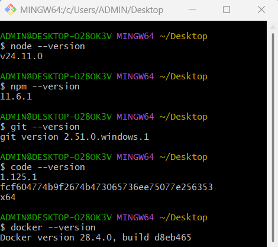
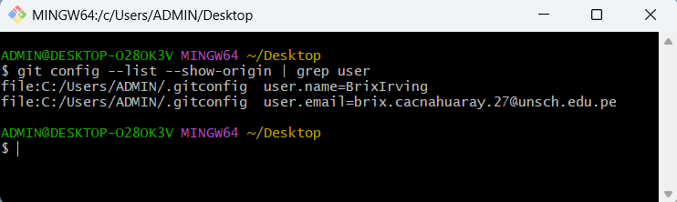
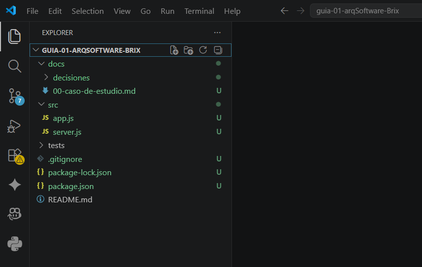
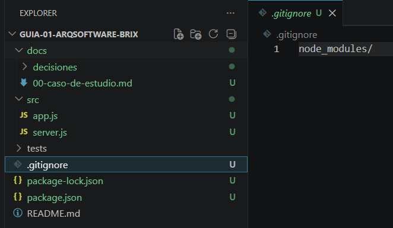

# Información del curso

## Datos del estudiante

**Nombre completo:** Brix Irving Cacñahuaray Meza

## Descripción del curso

Este curso tiene como objetivo desarrollar y fortalecer los conocimientos y habilidades necesarios relacionados con los temas tratados durante el desarrollo de la asignatura. A través de actividades prácticas y teóricas, se busca aplicar los conceptos aprendidos y adquirir experiencia en el uso de las herramientas correspondientes.

## Expectativas del estudiante

Mis expectativas respecto al curso son adquirir nuevos conocimientos, fortalecer mis habilidades prácticas y comprender mejor los conceptos desarrollados durante las clases. También espero poder aplicar lo aprendido en proyectos y situaciones prácticas que contribuyan a mi formación académica y profesional.

## Docente

**Nombre completo:** Ing. Lizbeth Jaico Quispe

## Evidencias

### Paso 1

### Paso 2

### Paso 3

### Paso 4

